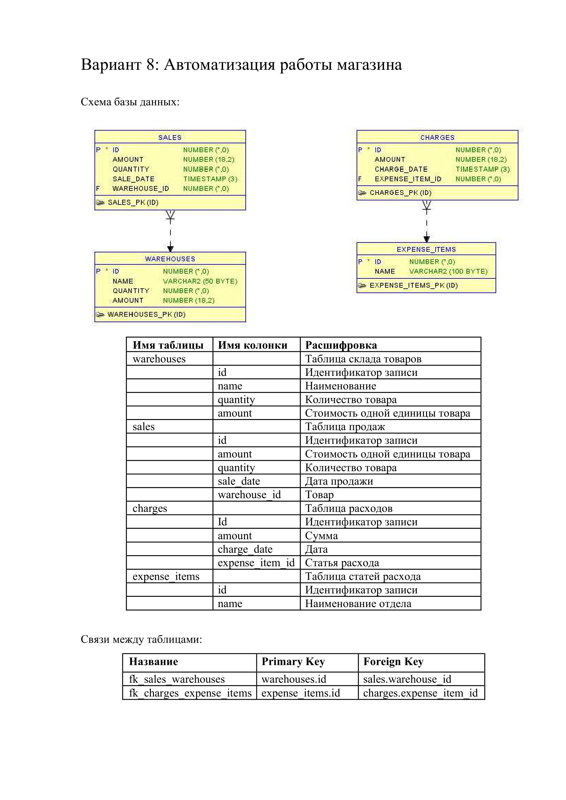

# Курсовая работа по дисциплине "ООП. Java"
## 2-й семестр 2-го курса СПбПУ ИКНТ ПИ (2021-2022 уч. г.)
---
### Разработать приложение, предоставляющее REST API для взаимодействия с базой данных.
#### Порядок выполнения работ:
* Перенести схему БД в выбранную СУБД
* Реазиловать подключение к БД посредством JDBC
* Подключить к проекту любой сборщик проектов, подключить фреймворк Spring и необходимые компоненты
* Реализовать 20 различных запросов на добавление, выборку, обновление и удаление данных из базы, как минимум 5 из них должны взаимодействовать сразу с несколькими таблицами
* Реализовать эндпоинты для взаимодействия с базой извне
* Подключить Spring Security
* Добавить эндпоинт авторизации, ограничить выполнение запросов неавторизованными пользователями только запросами на выборку данных
### Разработать консольное или веб-приложение в качестве UI
---
### Схема БД

